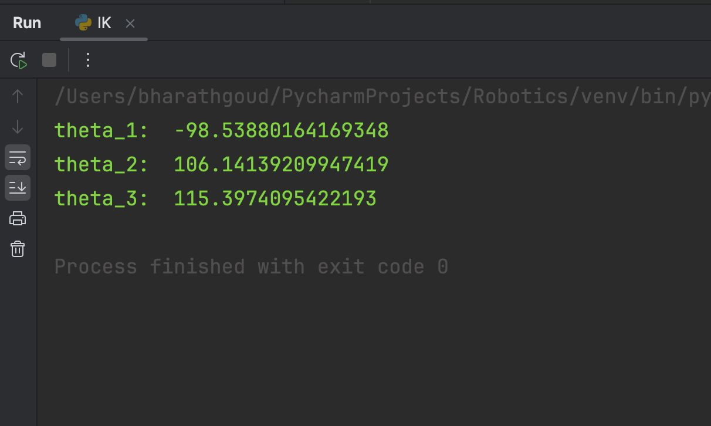

# Quadruped Robot Project

## Timeline: January 2024 - April 2024

### Introduction
During my college's 4th semester, I intended to do a project on kinematics and dynamics. After learning several projects through web searches, I found many references and browsed through various of them. Eventually, I developed a decision to create a quadruped robot, since it included prime ideas of forward kinematics (FK) and inverse kinematics (IK) concepts, and I was determined to study both topics in-depth.

### Design and Development
1. **CAD Design:**
- As I was not familiar with CAD designing, I took reference from open-source designs on websites such as Thingiverse and GrabCAD.
- After going through several designs, I chose an appropriate one that suited my project requirements.
- The design I used is available here:https://www.thingiverse.com/thing:4815137

2. **Kinematics and Frame Arrangement:**
- To make the robot move, I learned and applied forward and inverse kinematics.
- I discovered various arrangements of frames and how they affected the motion of the robot.

3. **Hardware Components:**
- **Microcontroller:** Arduino Nano
- **Actuators:** 12 servo motors (3 in each leg, so each leg is a 3R manipulator)
- **Power Management:** Buck converter for regulating voltage
- **Connectivity:** Sensor shield to connect the servos to the microcontroller
- **Frame and Structure:** 3D-printed components held together by screws and fasteners
- **Power Source:** LiPo battery to power the servos
- **Sensors:** IMU sensor for balance and orientation (intended for future upgrade)

4. **3D Printing & Assembly:**
- I took STL files from the selected design and 3D-printed every component of the robot.
- I measured all necessary lengths using a vernier caliper and recorded them for precise kinematic calculations.

### Kinematics and Motion Planning
#### Forward Kinematics (FK)
- Forward kinematics refers to the process of calculating the end effector position and orientation from specified joint angles.
- It uses a set of transformations to transform joint parameters to Cartesian coordinates of the end effector.
- FK is crucial to comprehend how the robot moves when particular inputs are provided to the joints.

#### Inverse Kinematics (IK)
- Inverse kinematics is the process of computing the joint angles required to place the end effector at a desired position.
- In contrast to FK, which is simple, IK usually requires solving complicated nonlinear equations.
- I used IK in Python to manage the movements of the quadruped efficiently.
### OUTPUT

#### Workspace Exploration
- The workspace of a robot specifies the entire region within which the end effector can travel.
- It is divided into two types:
  - **Reachable workspace:** Points that are reachable at least one way.
- **Dexterous workspace:** Points that can be accessed in more than one manner.
- Comprehending workspace is paramount to creating motion strategies and ensuring the robot is able to reach all required positions.

#### Motion Planning
- Motion planning is the process of creating a sequence of motions so that the robot can move from one state to another.
- It encompasses collision avoidance, path optimization, and smooth switching between postures.
- I learned about various motion planning methods to apply primitive locomotion techniques.

#### Trajectory Planning
- Trajectory planning makes the movement smooth in terms of time.
- It also includes the computation of velocity and acceleration profiles to optimize the motion of the robot.
- Various algorithms, including polynomial interpolation and spline-based methods, can be applied to optimize the trajectory.

### Programming and Testing
- Used FK and IK calculations in Python.
- Experimented with various angles and checked if the end effector touched the target points.
- Tested movement strategies and optimized motion planning algorithms.

### Takeaways and Learnings
- Developed a clear grasp of forward and inverse kinematics.
- Learned to mathematically solve FK and IK problems and code them in Python.
- Familiarized oneself with the notion of a robot's workspace and its real-world applications.
- Learned the fundamentals of motion and trajectory planning.
- Enhanced my understanding of 3D printing and mounting mechanical components.
- Played with electronic elements and microcontrollers to drive servo motors.

### Future Enhancements
- I would like to work on designing more sophisticated trajectory planning algorithms in order to increase the efficiency and accuracy of robot movement.
- Power optimization and better servo control are a top priority so the robot can move smoother and draw less power.
- I would like to research machine learning methods that can assist in adaptive motion planning to make the robot smarter in navigating various terrains.
- Enhancing the CAD design will assist in making the robot lighter and more structurally efficient, minimizing material consumption while maximizing performance.
- Incorporating additional sensors for increased stability and real-time feedback control will assist in enhancing the robot's balance and responsiveness to various surfaces.

